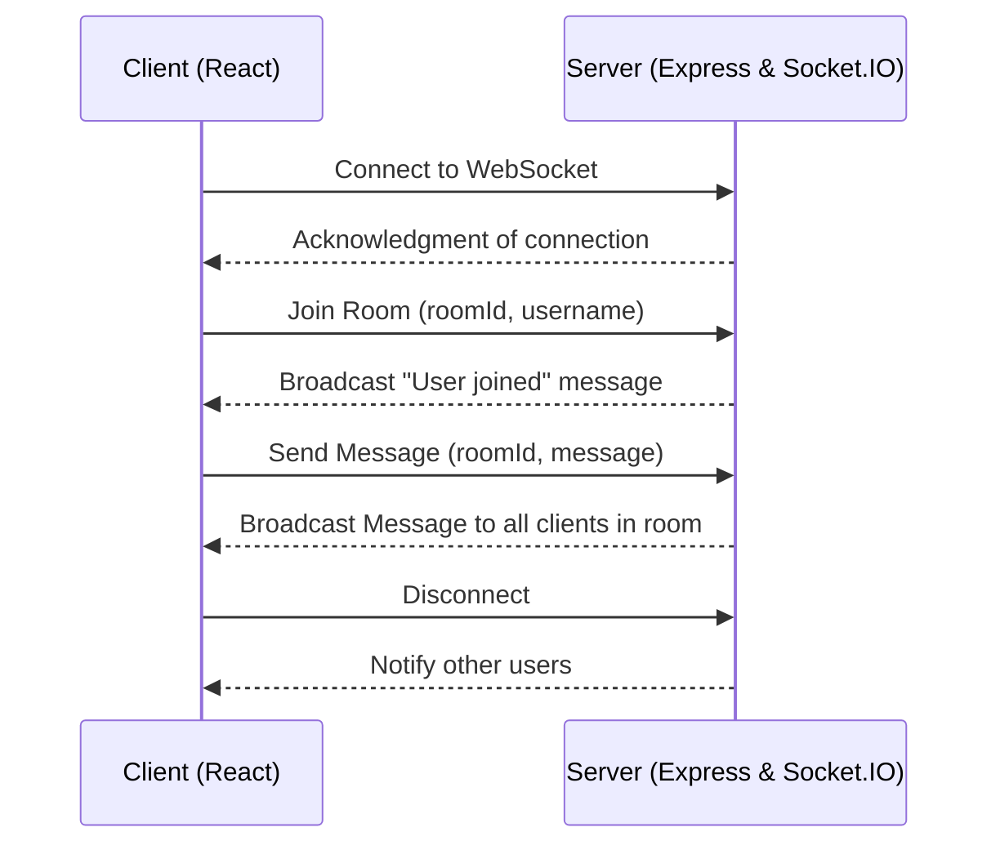
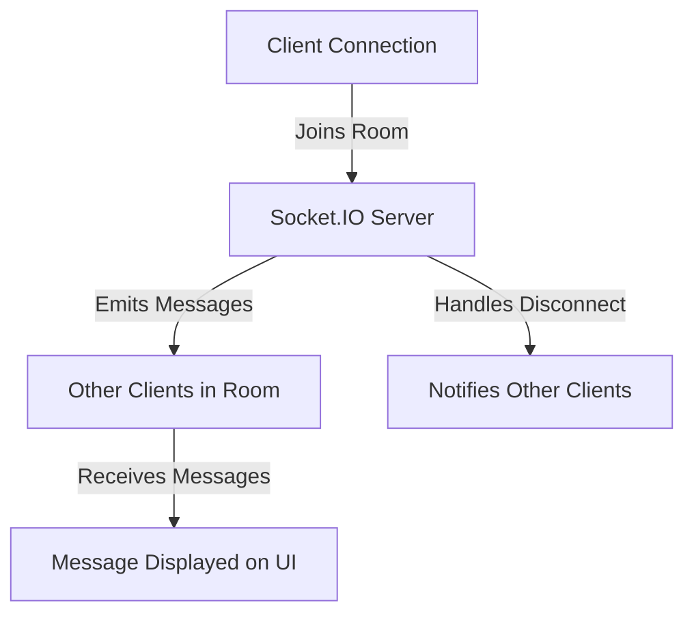
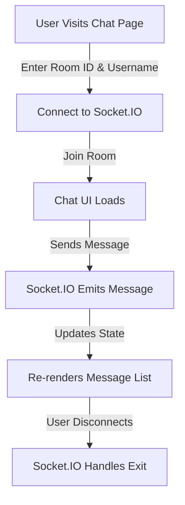

# Real-Time Chat Application

This project is a real-time chat application built using Express.js and Socket.IO for the backend, and React for the frontend.

## Architecture Overview

The chat system follows a client-server architecture using WebSockets for real-time communication.

### High-Level Architecture



## Backend (Express & Socket.IO)

- Uses Express.js to serve the WebSocket server.
- Socket.IO manages real-time bidirectional event-based communication.
- Users can join chat rooms, send messages, and receive messages in real time.

### Server Architecture



## Frontend (React & Socket.IO Client)

- React is used to build the chat UI.
- React Router manages chat rooms dynamically.
- Socket.IO client handles communication with the server.
- Messages are updated in real time using the useState hook.

### UI Flow
Here is a simple flow chart:




## Setup & Running the Project

1. Clone the repository:
   ```sh
   git clone https://github.com/your-repo/chat-app.git](https://github.com/Suraj370/expresschat.git
   cd chat-app
   ```

2. Install dependencies:
   ```sh
   npm install
   ```

3. Start the backend server:
   ```sh
   cd server
   pnpm run dev
    ```

4. Start the frontend:
   ```sh
   npm run dev
   ```

## Features
- Real-time messaging
- Room-based chat
- Message timestamps
- User join and leave notifications

## Technologies Used
- **Backend:** Node.js, Express, Socket.IO
- **Frontend:** React, Tailwind CSS, Socket.IO Client


